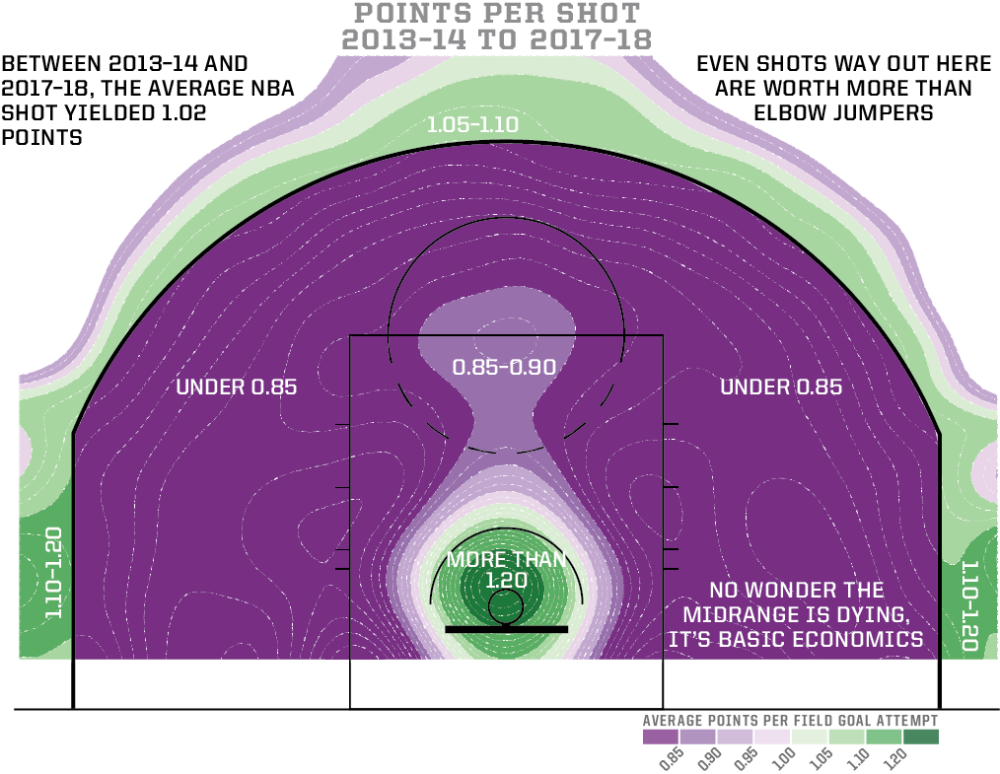

```{r setup, include=FALSE}
knitr::opts_chunk$set(echo = TRUE, fig.align="center")
library(tidyverse)
library(dplyr)
library(tidyr)
library(kableExtra)
```

# Introduction
Basketball is a sport that is continuously evolving. Ever since its invention in 1891, there have been many changes in both the rules and the style of play. Over the past decade, the league has undergone a rapid change due to both the increase in the use of analytics and changes in officiating. 

NBA basketball in the 2010s will be remembered as the beginning of the “pace and space” era. Teams now play at a faster pace compared to the previous two decades and shoot far more three-point shots per game. This stylistic change is in part due to the success of the Golden State Warriors lead by Stephen Curry and the Houston Rockets, which forced other teams in the league to also emphasize spacing the floor to draw out defenders. 

The rise of analytics, especially with Daryl Morey and the Rockets has led to more layups and three-point attempts while also creating a sharp decline in long-range twos and midrange shots. The midrange jumpshot, the staple for superstars such as Kobe Bryant and Michael Jordan, has been mostly abandoned except by the most efficient scorers such as Chris Paul and Kevin Durant. Combined with officiating favoring offense over defense, players are now scoring more points with better efficiency compared to 10 years ago.

This blog will use two methods to observe the shift in strategy over the course of the history of the NBA. The first is to analyze shot location data, where the trend in the different locations where players shoot the ball are tracked since the 2010-2011 season. The second is by comparing present-day seasons to historical seasons. Finding the top historical comparisons to players today is interesting because one can determine if there are any players today that are similar to historical greats. In addition one can examine how the league has changed by comparing “old-school” players such as Demar Derozan versus more modern players such as Nikola Jokic. 

# Shot Data and Mapping
To get the shot data, we found a `R` package online which gets shot map data from the NBA stats website and API called BallR (`ballr`). 

## Shot Data using `ballr` package and the NBA API
The BallR  package uses the NBA Stats API to help visualize shots taken by a player for a season. To run BallR, we have to run the following code in the console (taken from the BallR documentation).

```{r, eval = FALSE}
packages = c("shiny", "tidyverse", "hexbin")
install.packages(packages, repos = "https://cran.rstudio.com/")
library(shiny)
runGitHub("ballr", "toddwschneider")
```

This will run the shiny app locally on your computer and will load the following functions and methods that we will need to use to generate a heat map of shot density: 

- `court_maps.csv`, which is a dataframe that holds all the points of the different zones of a basketball court, like a map
- `plot_court.R` and `plot_theme.R`, which are methods needed to draw the court
- `generate_heatmap_chart`, which is a function used to generate the heat map of shot data
- `fetch_shots_by_player_id_and_season` which is a function used to get shot data from the NBA API using a player's ID and the season they were playing in.

The last function is a function we used to collect all the shot map data for all players in all season. To do this, we had to figure out all the player ID's for all the players from the seasons between 2010 and 2021. After that, we iterated through every combination of player ID and season (if they played in that season) and used the fetch shots function to get all the shot data for all players. Running this code, we noticed that there seemed to be a hard limit of around 600, so we had to hard reset the function everytime it reached the limit. Some example code below shows our method to extract all the shot map data. 

```{r, eval = FALSE}
for(i in 1:nrow(player_stats)){
  ## for a dataframe called player_stats which has a player_id and season columns
  stats <- fetch_shots_by_player_id_and_season(player_id= player_stats$person_id[i]
                                    , season = test$season[i]
                                    , player_stats = "Regular Season")
  stats <- stats$player %>%
    mutate(season = test$season[i])
  
  ## df is our final data set we are outputting
  df <- rbind(df, stats)

  ## uncomment if you want to see the code running to make sure it isn't frozen
  #print(i)
  
  ## Timer to not get kicked by API too fast
  if(i %% 15 == 0){
    Sys.sleep(5)
    #print("Done Sleeping")
  }
}
write.csv(df, "Data/total_shot_data.csv")
```

Our final data set was a `.csv` file that was over half a gigabyte in memory and over 1.9 million observations, after running our code for a few hours. 

# Player Season Data
The data used was scrapped from Basketball Reference. For each player and each season since 1982, the per-game and advanced statistics were collected. The original dataset was over 17,000 player-seasons, each with 43 statistical variables. In order to cut down the number of players analyzed, we decided to only examine “good” seasons, which were seasons where the player had a VORP (value over replacement player) of 1. To put into context, typically there are usually around 100 players per year with over 1 VORP. In order to account for the fact that many players play on multiple teams in one season, we only examine per-game and advanced stats rather than total stats and take the average for the player over the course of the season. Thus, we are able to obtain a relatively complete statistical profile for almost every “good” player for each year of their career.   

# Shot Type Graph and Table
In this graph we can see the trends in the percentage of shots in different zones for the league as a whole over the past decade. It is immediately apparent the sharp decline in the number of mid-range shots over the course of the decade. The decline of the mid-range shot has been fueled by an increase in three point shots as well as shots in the paint (near but not right at the basket). It is also noteworthy that the percentage of shots in the restricted area has also declined over the past decade even though it is the most efficient shot. This is likely due to defenses focusing on limiting these efficient shots as much as possible.  

```{r, line_graph, echo = FALSE, message = FALSE}
stat_names <- c("In The Paint (Non-RA)", "Mid-Range", "Restricted Area", "Three-pointers")

season_zones_table <- read.csv("Data/season_zones_table.csv") %>%
  select(-c(X))
for(i in 1:4){
  names(season_zones_table)[names(season_zones_table) == names(season_zones_table)[i + 1]] <- stat_names[i]
}
season_zones_table %>%
  mutate(
    across(c(2:5), .fns = ~./total)
  ) %>%
  select(-c(total)) %>%
  pivot_longer(
    cols = 2:5,
    names_to = "shot_zone",
    values_to = "percentage",
  ) %>%
  rowwise() %>%
  mutate(year = as.numeric(strsplit(season, "-")[[1]][1])) %>%
  ggplot(mapping = aes(x = year, y = percentage, color = shot_zone)) +
  geom_line() + 
  scale_y_continuous(labels = scales::percent) +
  scale_x_continuous(breaks = c(2010, 2012, 2014, 2016, 2018, 2020)) + 
  labs(
    title = "\n Percentages of Shots Taken In Each Area Each Season",
    subtitle = "From 2010-2021",
    color = "Shot Zone Area",
    y = "\nPercentages\n",
    x = "\nYear\n"
  )
```

```{r, table, echo = FALSE}
season_zones_table %>% 
  rename(Season = season, Total_Shots = total) %>%
  kable()
```
In the table above, it is also apparent that the total number of shots has increased over the past ten years (2020 and 2021 seasons are cut short but per game shots are up). This is largely due to teams playing at a faster pace. While this graph captures trends at a high level, we would also like to view exactly where players today are shooting more shots compared to ten years ago. 


# Heat Map
Using the BallR package, we can generate heatmaps of the shots in different locations around the league. The heat map provides several advantages. First is that not all shots in the same zone are of the same quality. For example, three point shots in the corners are among the most efficient shots in basketball and are significantly more valuable than three point shots “above the break” where the line is curved. In addition, formerly popular areas to shoot in the midrange such as the elbows and baseline jumpshots have declined significantly.

In the documentation, here is how the `generate_heatmap_chart` function works. 

```{r, eval = FALSE}
generate_heatmap_chart = function(shots, base_court, court_theme = court_themes$dark) {
  base_court +
    stat_density_2d(
      data = shots,
      aes(x = loc_x, y = loc_y, fill = stat(density / max(density))),
      geom = "raster", contour = FALSE, interpolate = TRUE, n = 200
    ) +
    geom_path(
      data = court_points,
      aes(x = x, y = y, group = desc),
      color = court_theme$lines
    ) +
    scale_fill_viridis_c(
      "Shot Frequency    ",
      limits = c(0, 1),
      breaks = c(0, 1),
      labels = c("low", "high        "),
      option = "inferno",
      guide = guide_colorbar(barwidth = 10)
    ) +
    theme(legend.text = element_text(size = rel(0.6)))
}
```

Using the other objects generated from the `ballr` package mentioned before, we can write a for loop to generate the heat maps for all of the desired seasons, and plot them below.

```{r, eval = FALSE}
for(i in 0:10){
  curr_season = paste0(2010 + i,"-",11+i)
  output %>%
  filter(season == curr_season, shot_zone_basic %in% shot_zone_basic_list) %>%
  generate_heatmap_chart(
    base_court = plot_court(court_themes$dark),
    court_theme = court_themes$dark
  ) + labs(
    title = "Heat Map of All Shots",
    subtitle = paste(curr_season, "Season")
  )
  ggsave(paste0(curr_season, ".png"))
}
```


# Shiny App Player Comparisons
In this app, we can compare the similarity of a player’s 2021 season with historical seasons dating back to 1982. Our similarity index is the euclidean distance taking into account all of the 43 statistical variables that are in the dataset. After normalizing each variable, we are able to output a list of the most similar historical season to the selected player’s 2021 season. It is interesting to observe that the most similar players tend to be recent rather than further in the past. This indicates that the playstyle of the league has shifted dramatically as players are different than before from a statistical standpoint. While this method of comparing seasons can be improved, it is still valuable in determining that most 2021 seasons are similar statistically to seasons in the past 5 years rather than in a previous era. 

[Here is our link to our shiny app!](https://kejin22.shinyapps.io/Blog-Lebron-Warrior-Hawks/)

## Examples of player comparisons {.tabset .tabset-fade .tabset-pills}

### LeBron James


### Nikola Jokić


### DeMar DeRozan


# Conclusions
## How has the league play style changed over time?

By analyzing each year, it is evident that the league has undergone drastic changes in the types of shots that are the most valued. It is apparent that there has been a dramatic shift from shooting midrange jumpshots to three-point jumpshots, specifically corner three-point shots. It is clear that in previous years offenses favored taking shots as close to the basket as possible. Due to the fact that restricted area shots are the most efficient shots in basketball, the decline in percentage of shots in the restricted area may be caused by defenses being more willing to prevent these shots in the first place. As such, the shot graph and heatmaps demonstrate how teams are trying to shoot more efficient shots and prevent other teams from shooting efficient shots instead of just trying to shoot closer to the basket. 

## How similar are current day players to historical greats?

With our Shiny app, it can be seen that players today are statistically similar to other modern day players rather than players of previous generations. As such, when comparing how “good” a player is, it is not very useful to compare statistics across large time periods. Instead, players should be compared relative to the peers they play against. Thus, comparing the statistical profile of Lebron James versus Michael Jordan is rather pointless as they play in such different eras. In addition, some historical comparisons are quite surprising. For example, the top historical comparisons to Nikola Jokic, the leading candidate for MVP for the 2020-2021 season are Larry Bird and Lebron James, both of whom are much smaller than Jokic and play different positions. However, Bird, James, and Jokic share great playmaking and efficiency on offense, leading to the statistical similarity.  

On the other hand, DeMar Derozan, one of the few throwback players in the NBA, is not similar to many modern players and is instead comparable to volume shooters in the 1990s and 2000s. Another historical great that many good players today such as Giannis Antetokounmpo and Joel Embiid are similar to is Charles Barkley, who was dominant in the 1990s with his great rebounding and interior scoring skills. What is a little ironic is that Barkley is amongst the most critical of current-day players for being “soft” and “technique-driven” when he was amongst the first players with a “modern” game.

# Limitations and Future Research

## Limitations
For the heatmaps we generated, we excluded shots around the basket as due to the high concentration of shots in that area, it would have made it difficult to visualize shots in other zones around the basketball court. For each year, if we were to include at-the-rim shots, that area would be a bright yellow. 

When calculating the euclidean distance between the seasons of different players, we weigh each stat by the same amount. When evaluating players, not all stats are equally important. However, there is also not much agreement on which statistic matters the most. As such, this is an area that can be improved by allowing users to select which stats are important to them and weigh each stat differently. 

## Future Research
While we examine the volume of shots from different areas of the court, we have not examined the efficiency of different shots. For example, it may very well be the case that players are shooting more three point shots but they are now shooting at a lower percentage than before due to higher volume. As such, examining trends over time with regards to efficiency would be an interesting project. Identifying areas where players score the most efficiently can lead to the evolution of new strategies to both take more efficient shots and deny these opportunities for opponents. In the graphic below from FiveThirtyEight, one can determine the points-per-shot for each location between 2013-14 to 2017-18:


#Citations

